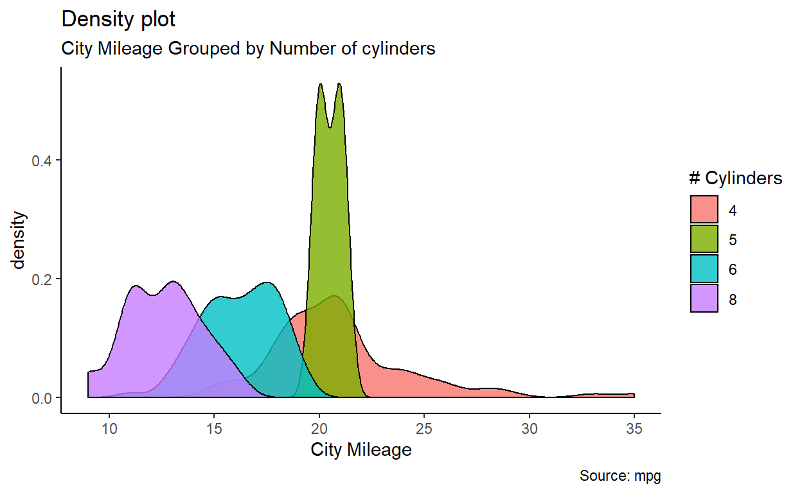

  My first experience in statistics using [**R**](https://www.r-project.org/)  programming language was 10 years ago, the task was to program an extension of  [PCA](https://towardsdatascience.com/principal-component-analysis-pca-101-using-r-361f4c53a9ff) __Principal Component Analysis__ algorithm . <br>
  At that time, I was not aware of the existence of [RStudio](https://rstudio.com), so I used the R-shell directly.<br>
It was very tideous but since then R did not stop surprising me and remains my favourite programming language. 

  In the article below, a brief summary will take you through the most useful features neeeded to transform your "Data-Driven" initial idea into productive project using R features, starting from data upload into reactive reporting. 

## R is only for prototyping

  Many internet articles speculate  about R *non-suitability* in production, in other words, R is only used for *prototyping*. <br> 
  In my opinion, it's not the case, but it requires to take into account some R-specific concerns, such as :
  
*  packages dependencies. 
*  R is single-threaded 

  Once these concerns are handled, R offers an attractive set of packages to use for Data Import, Data Manipulation, Analysis , Machine Learning /Deep Learning, Econometrics . 
In addition to that user-friendly interactive reporting and dashboarding tools such as :

* Shiny 
* Rmarkdown 

## Prerequisites

  As a preliminary step, you need to have necessary tools installed and make sure that all of them work together. 
  
### R : install the recent version ? 

  In order to benefit from the most innovative features and functionalities, it's always better to have the most recent version of the Software, however on the other hand you need to make sure that this version is **stable** .<br>
  If you want to deploy the same script on cloud, so make sure to have the same R-version on local and on cloud. <br>
  
  

### user-freindly IDE: Rstudio or Visual Studio

You can choose from multiple ones , and for me Rstudio remains the well suited , especially if you want to use it for Projects creation ( shiny, rmarkdown websites, CV(vitae), ...)

### Rtools

  Once your favourite IDE is successfully installed, it is highly recommanded to install  a *toolbox* called [**Rtools**](https://cran.r-project.org/bin/windows/Rtools/) which plays a role of package builder <br>
  Make sure to install the compatible version with your R version .
  Rtools is mainly used to install some special packages basically java built such as "rJava" and "rjson".

## Data Import 

*Data is the new oil* , then lets dig and load them . <br>

There are several packages which enable you to import your raw data, below are the frequently used : 

- **readr** in order to import data from csv , txt files 
- **readxls** read data fromm excel files
- **odbc**  enables to establish connection to your Database and read in data directly.


## Data Exploration and Manipulation : tidyverse family  

Now we have imported data, the next step is visualize it and get some basic informations. 
To do so use *View* command from base library and *glimpse* command from 
**dplyr** <br>.

The following step is to clean and prepare your data, and for that we use a set of packages from **tidyverse**

-  **tidyr** : cleaning (remove and replace NAs, complete missing data), reshape my data using *tidyr::pivot* command
-  **dplyr** : preparation and manipulation by adding new variables *mutate* or aggregating data by groups *group_by* and *summarise*. 
If you have more than one data table you can easily join them using *left_join ,right_join* r *full_join*

-  **stringr** : if by chance you have text in your data, stringr helps you to operate manipulation on your text such symbols cleaning , spaces , undesired characters. 


- **lubridate** having a date variable in your data is like a **black horse** not easy to handle but mainly offers huge potential for data exploration and analysis . <br>
In order to handle that variable and extract as many as possible of information, I would highly recommand to use lubridate . 


-  **purrr**   : The sexiest feature. 

-  **ggplot2** you applied all necessary transformation and manipulations and the data is ready . <br>
Visualization is a *must* , it delivers implicit and explicit insights of your data (interdependencies , similarities, correlations,...).<br>
ggplot has the  complete profile to display all what you need (boxplot, bar-charts, pie-charts, density curve, ..)

<div class="layout-chunk" data-layout="l-body">

```r
library(ggplot2)
theme_set(theme_classic())

# Plot
g <- ggplot(mpg, aes(cty))
g + geom_density(aes(fill=factor(cyl)), alpha=0.8) + 
    labs(title="Density plot", 
         subtitle="City Mileage Grouped by Number of cylinders",
         caption="Source: mpg",
         x="City Mileage",
         fill="# Cylinders")
```



</div>


### Pipe operator %>%

  available in magrittr, dplyr, and other R packages, process a data-object using a sequence of operations by passing the result of one step as input for the next step using infix-operators rather than the more typical R method of nested function calls.<br>
  
Below is an example :

<div class="layout-chunk" data-layout="l-body">

```r
library(dplyr)
library(lubridate)
library(DT)

economics %>% mutate( years = year(date))%>% # add new variable years
  group_by(years)%>%  # group data by years
  summarise_if(is.numeric, mean, na.rm = TRUE)%>% #aggregate only numerical variables (sum)
  round(2)%>% # round my data to 2 digits
  datatable() # display the results using datatable from(DT package)
```

<!--html_preserve--><div id="htmlwidget-cdbe630776db75fc894b" style="width:100%;height:auto;" class="datatables html-widget"></div>
<script type="application/json" data-for="htmlwidget-cdbe630776db75fc894b">{"x":{"filter":"none","data":[["1","2","3","4","5","6","7","8","9","10","11","12","13","14","15","16","17","18","19","20","21","22","23","24","25","26","27","28","29","30","31","32","33","34","35","36","37","38","39","40","41","42","43","44","45","46","47","48","49"],[1967,1968,1969,1970,1971,1972,1973,1974,1975,1976,1977,1978,1979,1980,1981,1982,1983,1984,1985,1986,1987,1988,1989,1990,1991,1992,1993,1994,1995,1996,1997,1998,1999,2000,2001,2002,2003,2004,2005,2006,2007,2008,2009,2010,2011,2012,2013,2014,2015],[514.47,556.84,603.65,646.73,699.92,768.15,849.58,930.15,1030.56,1147.67,1273.97,1422.25,1585.42,1750.67,1933.94,2071.24,2281.61,2492.33,2712.84,2886.28,3076.28,3330,3576.77,3809,3943.45,4197.57,4451.98,4720.96,4962.6,5244.6,5536.78,5877.25,6279.08,6762.15,7065.63,7342.68,7723.11,8212.67,8747.13,9260.35,9706.42,9976.33,9842.19,10185.85,10641.12,11006.83,11317.2,11824.02,12120.12],[199200.33,200663.75,202648.67,204982.33,207589.33,209837.58,211857.17,213814.75,215890.67,217999.25,220193.08,222525.42,225002.83,227621.92,229915.67,232127.83,234246.5,236307.25,238415.5,240592.67,242750.75,244967.5,247285.92,250047.42,253391.83,256777.17,260146.42,263324.58,266458.17,269580.67,272822.08,276022.33,279194.92,282295.92,285215.92,288019,290733.33,293388.58,296114.92,298929.92,301903.17,304718,307373.75,309736.51,311940.75,314163.1,316329.3,318619.45,320159.06],[12.43,11.33,10.9,12.8,13.47,12.35,13.45,13.3,13.41,11.62,10.66,10.72,10.32,11.06,11.72,12.04,10.05,11.32,9.17,8.83,7.91,8.47,8.38,8.37,8.8,9.45,7.92,6.91,6.99,6.56,6.33,6.8,5.08,4.81,5.03,5.83,5.56,5.16,3.18,3.85,3.74,4.97,6.11,6.55,7.16,8.83,6.41,7.35,7.65],[4.7,4.5,4.44,4.98,6.28,6.11,5.17,5.18,8.47,8.14,7.07,5.95,5.58,6.66,7.02,8.75,10.16,7.88,6.93,6.96,6.47,5.95,5.22,5.38,6.87,8.66,8.31,9.12,8.24,8.24,7.93,6.68,6.33,5.93,6.73,9.2,10.18,9.82,8.93,8.22,8.5,9.42,15.68,21.47,21.44,19.17,16.81,14.18,12.4],[3012.33,2797.42,2830.17,4127.33,5021.67,4875.83,4359.33,5173.33,7939.58,7398.17,6966.92,6187.08,6135.33,7670.67,8276.33,10714.92,10693.75,8529.08,8313.42,8245,7413.5,6696.58,6523.67,7061,8639.83,9611.17,8926.67,7975.5,7406.92,7231.08,6728.67,6203.83,5878.83,5685.08,6829.67,8375.33,8770.33,8139.67,7579.17,6991.25,7073.08,8948.17,14294.5,14807.75,13738.5,12499.17,11457.17,9601.5,8635.75]],"container":"<table class=\"display\">\n  <thead>\n    <tr>\n      <th> <\/th>\n      <th>years<\/th>\n      <th>pce<\/th>\n      <th>pop<\/th>\n      <th>psavert<\/th>\n      <th>uempmed<\/th>\n      <th>unemploy<\/th>\n    <\/tr>\n  <\/thead>\n<\/table>","options":{"columnDefs":[{"className":"dt-right","targets":[1,2,3,4,5,6]},{"orderable":false,"targets":0}],"order":[],"autoWidth":false,"orderClasses":false}},"evals":[],"jsHooks":[]}</script><!--/html_preserve-->

</div>


  
## Analytics

### Econometrics 

- **forecast**
- **prophet**

### Machine Learning Suit: tidymodels
If *shallow learning* does not work then use *deep learning* , if else then *blame your data*


#### Unsupervised Learning


#### Supervised Learning

**Classification**


**Regression**


#### Reinforcement Learning


### Save your results : data , model

* **saveRDS**
* **feather**

## Reporting 

### Shiny

<div class="layout-chunk" data-layout="l-body">


</div>


### rmarkdown 

- **flexdashboard**


<div class="layout-chunk" data-layout="l-body">


</div>


- **pretty_doc**


## Analytics R-based  Web-apps 

Shiny has proved itself a great tool for communicating data science teams’ results. However, developing a Shiny app for a large scope project that will be used commercially by more than dozens of users is not easy.

The first challenge is User Interface (UI): the expectations are that the app should not vary from modern web pages.

Secondly, performance directly impacts user experience (UX), and it’s difficult to maintain efficiency with growing requirements and user base.


### shinyproxy  

### Dockerisation and R 


## Useful links 

* **rweekly** :[rweekly.org](rweekly.org)
* **datacamp** : datacamp ( R track)


